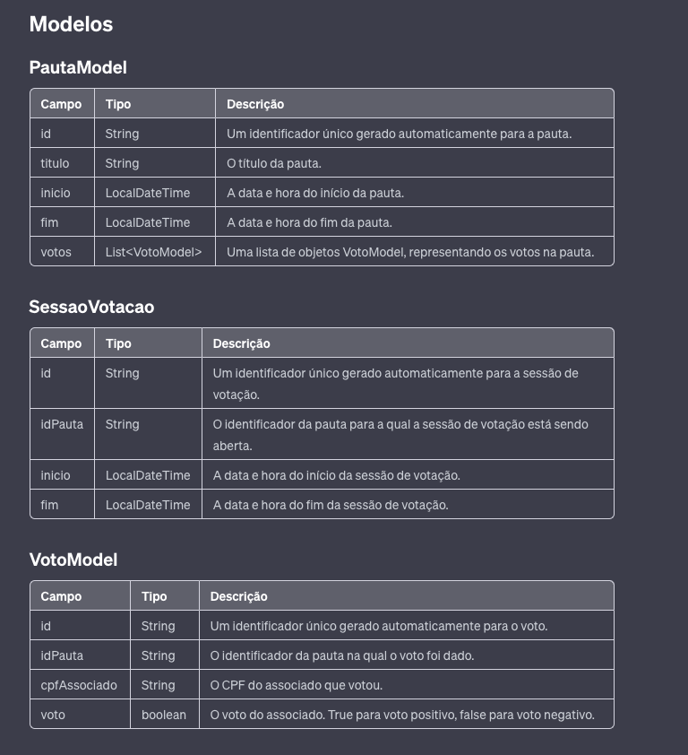

## Execução

A execução é feita pelo script

```bash
./StartScript.sh
```

Após o processamento do script, para acessar o swagger da API, basta acessar o endereço:
<a href=“http://localhost:9090/swagger-doc/swagger-ui.html“>Swagger</a>
```
http://localhost:9090/swagger-doc/swagger-ui.html
```

#### Ou usar a especificação abaixo em um cliente Rest como por exemplo o Postman.

#### No diretório ./dvs/collectionPostman, está o arquivo de importação da collection do Postman

# Especificação API de Votação Sicredi
#### Este documento fornece a especificação para a API de votação do Sicredi. A API permite criar pautas, votar em pautas e recuperar os votos de uma pauta específica.

## Endpoints
# POST /api/v1/pautas
Este endpoint é usado para criar uma nova pauta.

#### Requisição: Um objeto JSON representando a pauta a ser criada, conforme o modelo PautaModel:
```
{
"id": "String (gerado automaticamente)",
"titulo": "String",
"inicio": "DateTime",
"fim": "DateTime",
"votos": "[VotoModel]"
}
```

#### Resposta com Sucesso: Retorna a pauta criada como um objeto JSON no seguinte formato:

```
Código HTTP: 200 OK
```
```
{
"id": "String",
"titulo": "String",
"inicio": "DateTime",
"fim": "DateTime",
"votos": "[VotoModel]"
}
```
#### Resposta de erro:

```
400 Bad Request: Caso a entrada fornecida não esteja de acordo com o esperado (por exemplo, se os campos obrigatórios forem omitidos ou tiverem formato inválido).
```


# POST /api/v1/pautas/votos
#### Este endpoint é usado para votar em uma pauta.

#### Requisição: Um objeto JSON representando o voto a ser computado, conforme o modelo VotoModel:

```
{
"id": "String (gerado automaticamente)",
"idPauta": "String",
"cpfAssociado": "String",
"voto": "boolean"
}
```
#### Resposta com Sucesso: Retorna o voto computado como um objeto JSON no seguinte formato:

```
Código: 200 OK
```
```
{
"id": "String",
"idPauta": "String",
"cpfAssociado": "String",
"voto": "boolean"
}
```
#### Resposta de erro:
```
400 Bad Request: Caso a entrada fornecida não esteja de acordo com o esperado (por exemplo, se os campos obrigatórios forem omitidos ou tiverem formato inválido).
400 Bad Request: Em caso de um erro de votação, como indicado pela exceção VotacaoException.
```

# GET /api/v1/pautas/pauta/{idPauta}
#### Este endpoint é usado para recuperar todos os votos de uma pauta específica.

#### Requisição: idPauta como uma string no caminho da URL.

#### Resposta com Sucesso: Retorna uma lista de objetos VotoModel representando os votos para a pauta especificada. Cada objeto VotoModel tem o seguinte formato:

```
Código: 200 OK
```
```
[
{
"id": "String",
"idPauta": "String",
"cpfAssociado": "String",
"voto": "boolean"
},
...
]
```
#### Resposta de erro:

```
400 Bad Request: Se o `idPauta` fornecido tiver um formato inválido.
404 Not Found: Se não existir uma pauta com o `idPauta` fornecido.
```
Códigos de resposta:

# GET /api/v1/pautas/{idPauta}/votos
#### Este endpoint é usado para recuperar e contar os votos por pauta.

#### Requisição: idPauta como uma string no caminho da URL.

#### Resposta com Sucesso: Retorna um objeto JSON contendo a contagem dos votos "Sim" e "Não" e o resultado final da votação.

```
Código: 200 OK
```
```
{
"contagemVotos": {
"Sim": "Long",
"Nao": "Long"
},
"resultado": "String"
}
```
#### Resposta de erro:

```
400 Bad Request: Se o `idPauta` fornecido tiver um formato inválido.
404 Not Found: Se não existir uma pauta com o `idPauta` fornecido, ou se não houver votos para a pauta.
```
# POST /api/v1/pautas
#### Este endpoint é usado para criar uma nova pauta.

#### Requisição: Um objeto JSON representando a pauta a ser criada, conforme o modelo PautaModel:
```

{
"id": "String (gerado automaticamente)",
"titulo": "String",
"inicio": "DateTime",
"fim": "DateTime",
"votos": "[VotoModel]"
}
```

#### Resposta com Sucesso: Retorna a pauta criada como um objeto JSON no seguinte formato:

```
Código: 200 OK
```
```

{
"id": "String",
"titulo": "String",
"inicio": "DateTime",
"fim": "DateTime",
"votos": "[VotoModel]"
}
```

#### Resposta de erro:

```

400 Bad Request: Caso a entrada fornecida não esteja de acordo com o esperado (por exemplo, se os campos obrigatórios forem omitidos ou tiverem formato inválido).
Códigos de resposta:
```


# POST /api/v1/sessoes
#### Este endpoint é usado para abrir uma nova sessão de votação para uma pauta.

#### Requisição: Um objeto JSON representando a sessão de votação a ser criada, conforme o modelo SessaoVotacao:

```

{
"id": "String (gerado automaticamente)",
"idPauta": "String",
}
```

#### Resposta com Sucesso: Retorna a sessão de votação criada como um objeto JSON no seguinte formato:

```
Código: 200 OK
```
```
{
"id": "String",
"idPauta": "String",
"inicio": "DateTime",
"fim": "DateTime"
}
```
#### Resposta de erro:
```
400 Bad Request: Caso a entrada fornecida não esteja de acordo com o esperado (por exemplo, se os campos obrigatórios forem omitidos ou tiverem formato inválido).
404 Not Found: Caso a pauta especificada não exista.
```
# Backend
```
Tecnologias
- Gerenciador de dependências: Maven
- Linguagem de Backend: Java
- Framework de Backend: Springboot
- Banco de dados: Mysql

Arquiteturas
- Arquitetura de código: Clean Architecture
- Arquitetura de Software: MVC

Dependências:
- Spring Data MongoDB
- Spring Reactive Web
- Junit
- Lombok
- Webflux
- Log4j
- Spring Web
```


# Modelagem de dados:



